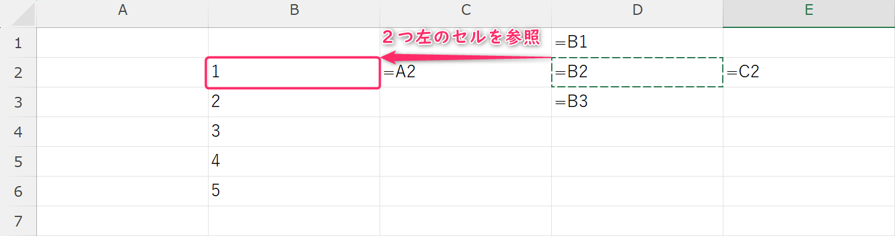
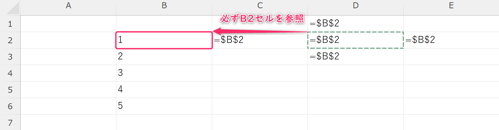

# コンピュータリテラシ応用
# 第5回：Excel
### 相対参照と絶対参照

情報学部 情報学科 情報メディア専攻
清水 哲也 ( shimizu@info.shonan-it.ac.jp )

---

# 今回の目標

- 目標：**相対 / 絶対 / 混合**参照を使い分け，式を**正しくコピー**できる
- 今日やること
  - 参照の仕組み
  - `F4`キー切替
  - 混合参照

> Keywords: Relative, Absolute, Mixed, F4, $A$1, A$1, $A1

---

# 授業内容

1. **タイピング練習（5分）**
2. 参照の考え方
3. F4で切り替え
4. 例①：税込金額（相対＋絶対）
5. 例②：一律割引（相対＋絶対）
6. 例③：九九表で混合参照
7. 演習

---

# 準備（ファイル）

- MoodleからExcelファイルをダウンロード
- **ファイル名**：`学籍番号_氏名_05_Ref.xlsx`
- 保存はこまめに：**Ctrl+S**

---

# 参照とは（要点）

- **相対参照**：コピー先に合わせて**動く**参照（例：`D2*E2`）
- **絶対参照**：どこへコピーしても**固定**（例：`$B$1`）
- **混合参照**：列または行だけ固定（例：`$B2` / `B$2`）

> `$` が付く場所＝**動かしたくない**場所。

---

# 参照とは（相対参照）

- **相対参照**：コピー先に合わせて**動く**参照（例：`D2*E2`）

---

# 参照とは（絶対参照）

- **絶対参照**：どこへコピーしても**固定**（例：`$B$1`））

---

# 参照とは（混合参照）

- **混合参照**：列または行だけ固定（例：`$B2` / `B$2`）

---

## 3) F4で切り替え

* 数式内でセル参照を選択 → **F4** を押すと **相対→$A$1→A$1→$A1→相対…** と切替
* **Mac**：機種により **fn+F4** または **⌘+T** で切替（学内PCで要確認）

> まずは **税込・割引** の“率”を `$セル` で**絶対参照**に固定するのが最重要。

---

## 4) 例①：税込金額（相対＋絶対）

**シート名：税込**

| セル     | 入力                         | メモ                  |
| ------ | -------------------------- | ------------------- |
| **B1** | 0.10                       | 税率（10%）             |
| A1:F1  | 日付, 商品, 単価, 数量, 金額, **税込** |                     |
| F2     | `=D2*E2`                   | 金額（相対）              |
| **G2** | `=F2*(1+$B$1)`             | **税込**（税率は**絶対参照**） |

* **G2を下へコピー**→どの行でも税率は **B1固定**
* 表示形式：金額・税込は **桁区切り**

---

## 5) 例②：一律割引（相対＋絶対）

**シート名：割引**

| セル     | 入力             | メモ                      |
| ------ | -------------- | ----------------------- |
| **B1** | 0.15           | 割引率（15%）                |
| F2     | `=D2*E2`       | 金額（相対）                  |
| **G2** | `=F2*(1-$B$1)` | **割引後金額**（割引率は**絶対参照**） |

> 税率・割引率の**置き場所を統一**（例：B1）→式が**読みやすく再利用**しやすい。

---

## 6) 例③：九九表で混合参照（列固定 / 行固定）

**シート名：九九**

1. A1 を空白、**B1:J1** に `1~9`、**A2:A10** に `1~9`
2. **B2** に数式：`=$A2*B$1`

   * `**$A2**`：**列A固定**（A列の段が固定）
   * `**B$1**`：**行1固定**（1行目の段が固定）
3. **B2** を **右と下**にオートフィル → きれいな九九表が完成

> 混合参照＝**見出し行と見出し列**を固定して交差計算するテクニック。

---

## 7) ハンズオン：3つの参照を使い分け

* **相対**：`金額 = 単価×数量`
* **絶対**：`税込 = 金額×(1+$B$1)`（税率固定）
* **混合**：`=$A行*列$1`（九九表）

> **F4** で `$` を素早く付け替え、**コピー→確認**（F2で参照を確認）

---

## 8) よくあるつまずき（対処）

* **税込が行ごとにバラバラ** → `$B$1` が `$` なしになっていないか
* **九九が斜めに同じ値** → 混合参照の `$` の位置が逆
* **数値にならない** → 文字列（左寄り）に注意、先頭の `'` を削除
* **%表示が変** → 値を 0.1 にして **パーセンテージ表示** を適用

---

## 9) 演習（提出対象）

**提出ファイル**：`学籍番号_氏名_05_Ref.xlsx`
**テンプレ**：`05_Ref_template.xlsx`（Moodle配布予定）

### シート1：税込（30点）

* B1に税率10%、列見出しは「日付, 商品, 単価, 数量, 金額, 税込」
* 5〜10行分のデータを入力
* `金額=単価×数量`（相対）、`税込=金額×(1+$B$1)`（絶対）
* 金額列は**桁区切り**、税込列は**通貨**表示

### シート2：割引（25点）

* B1に割引率15%
* `割引後=金額×(1-$B$1)`（絶対）

### シート3：九九（35点）

* 見出し行・列に `1~9` を配置
* B2に `=$A2*B$1` を入力し、右＆下にオートフィル
* 体裁を整える（中央揃え、外枠・内側の罫線）

> 合計：90点（+10点の任意加点：**割増税率の比較**シートを追加し、税率5%/8%/10%をプルダウンで切替）

---

## 10) ミニルーブリック（授業内活動）

| 観点   | C（基準）     | B（+）        | A（++）        |
| ---- | --------- | ----------- | ------------ |
| 相対参照 | 正しくコピーできる | ミスを自力で修正    | 式の可読性が高い     |
| 絶対参照 | 税率/割引率を固定 | 参照セルの配置が合理的 | 使い回し前提の命名・注記 |
| 混合参照 | 九九表が作れる   | 配置や体裁が良い    | 応用（行列入替など）   |
| 体裁   | 書式・罫線・配置  | 印刷設定が適切     | 全体が読みやすい     |

---

## 11) 参考操作（覚えると楽）

* **F2**：アクティブセルの式を編集（参照の色で追跡）
* **Ctrl+Enter**：同時入力／同時確定
* **Ctrl+`**：式の表示/非表示切替（グレイブ）
* **Ctrl+1**：セルの書式設定ダイアログ

---

## まとめ

* **相対**＝動く、**絶対**＝固定、**混合**＝片方だけ固定
* **F4**で素早く切替 → **コピーして確認**が基本動作
* 税率・割引率・見出しで**固定参照**を使うと、ミスを減らせる

---

# 次回まで

* 今日のファイルを見直して、`$` の位置が妥当か自己チェック
* 九九表で **10〜12** に拡張してみる
* 質問はMoodleのQ&Aへ

---

---

# 今回の目標

- 目標：**正しく入力**→**素早く増やす**→**見やすく整える**→**シートを扱える**
- 今日やること
  - 入力
  - セル移動
  - オートフィル
  - 数値・日付の書式
  - 表の体裁
  - シート操作

> Keywords: Input, Autofill, Formatting, Cell Styles, Sheet Rename/Copy/Move

---

# 授業内容

- **タイピング練習（5分）**
- 入力と移動
- オートフィル
- 数値・日付の書式
- 表の体裁（罫線・中央揃え・セルスタイル）
- シート操作（追加／削除／名前変更／コピー／色）
- 演習（基礎）
- **課題（やや多め）** の説明＆提出

---

# 準備（ファイル）

- Excelを起動 -> `空白のブック` を作成
- **ファイル名**： `学籍番号_氏名_04_演習.xlsx`
- 保存はこまめに：**Ctrl+S**

---

# 1. 入力とセル移動

- **確定**：`Enter`（下へ）／ `Tab`（右へ）／`Shift`+`Tab`（左へ）
- **改行**（セル内）：`Alt`+`Enter`
- **連番の正しい入力**：先頭ゼロを保ちたい場合は**文字列**に（先頭に`'`）
  - 例：電話番号`090xxxxxxxx` -> `'090xxxxxxxx`
- **日付の入力**：`2025/10/01`（西暦統一がおすすめ）

---

# 2. オートフィル（フィルハンドル）

- セル右下の四角（フィルハンドル）をドラッグ
- パターン例：
  - **連番**：`1`→`2`まで入力して2セル選択→ドラッグ
  - **曜日**：`月`→ドラッグ（`Mon`でもOK）
  - **日付**：`2025/10/01`→ドラッグ＝**1日ずつ**増える
  - **系列**：ホーム→フィル→**連続データの作成**（行/列、種類、増加量）
- **コピーだけ**したい：`Ctrl`を押しながらドラッグ

---

# 3. 数値・日付の書式

- **数値**：ホーム→数値→標準／数値（小数点桁数）／通貨／パーセンテージ
- **桁区切り**（,）を付ける：`桁区切りスタイル` ボタン
- **日付**：短い日付／長い日付
- **ユーザー設定表示形式**：`#,##0"円"`、`yyyy-mm` など

---

# 4. 表の体裁を整える

- **見出し行**：太字／中央揃え／塗りつぶし
- **列幅**：境界をダブルクリック＝最適幅／数値列は幅を広めに
- **罫線**：外枠→内側→見出し行は太線
- **セルスタイル**：タイトル、強調、良い・悪い など

---

# 5. シート操作（タブ）

- **追加**：`+`／右クリック→挿入
- **名前変更**：ダブルクリック（例：`売上入力`）
- **コピー／移動**：右クリック→移動またはコピー（**コピーを作成**にチェック）
- **色**：シートタブを右クリック→タブの色
- **非表示**：右クリック→非表示（戻す：表示→再表示）

---

# 演習（基礎）

**売上入力**シートを作る

- A1:H1 に見出し：`日付, 伝票No, 商品名, 単価, 数量, 金額, 担当, 備考`
- A2に`2025/10/01`、B2に`1001`、C2に`ノート`、D2に`120`、E2に`5`
- F2に **金額**：`=D2*E2`（後でオートフィル）
- A2 の日付を **5行**分オートフィル
- B2 の伝票Noを **連番**でオートフィル
- 体裁：見出し行に塗り・太字・中央、F列は`桁区切りスタイル`

---

# 課題

Moodleから課題用エクセルファイルをダウンロード
**提出ファイル**：`学籍番号_氏名_04_Excel.xlsx`

## (1) シート1：売上入力

* 見出し：`日付, 伝票No, 商品名, 単価, 数量, 金額, 担当, 備考`
* 10行分を入力（商品名は自由・数量は1〜9の整数）
* F列に **金額**=`単価×数量` を式で入れ、10行目までオートフィル
* 書式：F列に**桁区切り**、D列は**数値**（小数0桁）、A列は**短い日付**
* 体裁：見出し行に塗り、罫線（外枠・内側）

---

# 課題

## (2) シート2：日付系列と曜日

* A1に`開始日`、B1に`2025/10/01`
* A3:A9に`日付`、B3:B9に**1日ずつ**増加の系列を作成（オートフィル）
* C3:C9に **曜日** を表示（`表示形式`で`aaa`）
* 行全体の高さ・列幅を適切に調整（見やすさ重視）

---

# 課題

## (3) シート3：見本レイアウト再現

* スライドに示す**見本表**を**できるだけ近く**再現

  * 太字見出し／中央揃え／セルの塗り／罫線の太さを調整
  * 数値列は右寄せ、文字列は左寄せ
* 右上に **タイトル**（セル結合は使用可）

---

# 課題

## (4) シート4：タブ管理

* シート名をそれぞれ `売上入力` / `日付系列` / `レイアウト見本` / `メモ` に変更
* `売上入力` を **コピー** して `売上入力_控え` を作成（データはそのまま）
* `メモ` シートのタブ色を**緑**に変更

---

# 課題

## (5) 印刷の準備

* `売上入力`：印刷範囲を A1:F11 に設定（A4・縦・**余白 既定**・`縮尺：1ページに合わせる`）
* ヘッダー/フッター：**ページ番号**のみ

## (6) 仕上げ

* 先頭シートに **氏名・学籍番号**・提出日を小さく記入
* 最終確認：不要な空白行・空白列を削除、すべて保存

---

# 提出ルール

* 提出先：Moodle「第4回 課題」
* 提出物：`学籍番号_氏名_04_Excel.xlsx` **1ファイル**
* 期限：**授業終了時刻まで**

---

# よくあるつまずき（対処）

* **計算できない**：DとEが文字列になっていないか（左寄りは要注意）
* **日付が連番にならない**：入力が文字列（'）になっていないか確認
* **桁区切りが付かない**：表示形式が「標準」か「数値」か確認
* **連番が 1,1,1…**：1,2 と**2セル選択**してからドラッグ

---

# まとめ

* 入力の正確さ→オートフィルで量産→表示形式で見やすく→シートで整理
* フォーマットは“見た目”を変える機能。**データの中身は変えない**
* タブ名と印刷設定までできたら、**実務レベル**の第一歩
