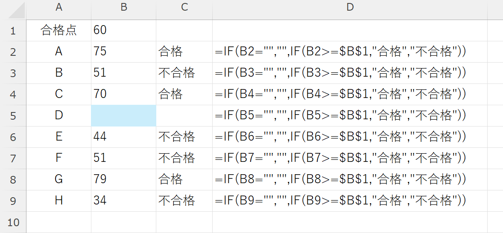

# コンピュータリテラシ応用
# 第6回：Excel いろいろな関数①
### IF関数 & データ数のカウント

情報学部 情報学科 情報メディア専攻
清水 哲也 ( shimizu@info.shonan-it.ac.jp )

---

# 今回の目標

- 目標：**`IF`** で条件分岐，**`COUNT/COUNTA/COUNTIF`** で件数集計ができる
- 今日やること
  - 論理式
  - 条件分岐：`IF`
  - 集計：`COUNT, COUNTA, COUNTBLANK, COUNTIF`

> Keywords: IF, Logical Test, COUNT, COUNTA, COUNTBLANK, COUNTIF, Criteria

---

# 授業内容

1. **タイピング練習（5分）**
   論理式の基礎
2. `IF`関数
3. カウント系（`COUNT/COUNTA/COUNTBLANK/COUNTIF`）
4. 課題

---

#  準備（ファイル）（ここは要修正）

* フォルダ：`CL_Apply/06_if_count`
* **ファイル名**：`学籍番号_氏名_06_IFCount.xlsx`
* 保存はこまめに：**Ctrl+S**（Mac：**⌘S**）

---

#  論理式（Logical Test）の基本

### 条件が成り立つかどうかを判定し，結果を`TRUE/FALSE`で返す式

- 例：`B2>=60` → B2セルの値がは60点以上なら`TRUE`, 未満なら`FALSE`
- 例：`C2="出席"` → C2セルの文字が「出席」なら`TRUE`, 違う場合は`FALSE`
- 比較演算子：`>` `>=` `<` `<=` `=` `<>`（≠）
- 文字の一致：`C2="出席"`（ダブルクォーテーションが必要）
- **注意**：全角/半角，空白，表記ゆれに弱い（"出席 "は別物）

---

# 比較演算子

| 演算子 |       意味（何を比べるか）       |   例（式）   |        判定結果の例         |
| :----: | -------------------------------- | :----------: | --------------------------- |
|  `=`   | 左右が**等しい**                 |   `B2=60`    | B2が60なら`TRUE`            |
|  `<>`  | 左右が**等しくない**             | `C2<>"出席"` | C2が「出席」以外なら`TRUE`  |
|  `>`   | 左が右より**大きい**             |    `D2>0`    | D2が0より大きければ`TRUE`   |
|  `<`   | 左が右より**小さい**             |   `E2<100`   | E2が100より小さければ`TRUE` |
|  `>=`  | 左が右以上（**大きいか等しい**） |   `B2>=60`   | B2が60以上なら`TRUE`        |
|  `<=`  | 左が右以下（**小さいか等しい**） |   `F2<=G2`   | F2がG2以下なら`TRUE`        |

---

# `IF`関数（条件分岐）

**書式**：`=IF(論理式, 真の場合, 偽の場合)`

* 例1：合否判定
  `=IF(B2>=60, "合格", "不合格")`

---

<!-- _class: no-footer -->

# `IF`関数（条件分岐）

**書式**：`=IF(論理式, 真の場合, 偽の場合)`

* 例2：閾値セルを使う（おすすめ）
  セル **＄B＄1** に合格点を置く → `=IF(B2>=$B$1, "合格", "不合格")`

---

<!-- _class: no-footer -->

# `IF`関数（条件分岐）

**書式**：`=IF(論理式, 真の場合, 偽の場合)`

* 例3：空欄なら空欄(`""`)を返す
  `=IF(B2="", "", ?)`

---

<!-- _class: no-footer -->

# `IF`関数（条件分岐）

**書式**：`=IF(論理式, 真の場合, 偽の場合)`

* 例3：空欄なら空欄(`""`)を返す → 空欄でない場合は通常の判定をする
  `=IF(B2="", "", IF(B2>=$B$1, "合格", "不合格"))`

---

<!-- _class: no-footer -->

# `IF`関数（条件分岐）

**書式**：`=IF(論理式, 真の場合, 偽の場合)`

* 例3：空欄なら空欄(`""`)を返す → 空欄でない場合は通常の判定をする
  `=IF(B2="", "", IF(B2>=$B$1, "合格", "不合格"))`

---

# カウント系の違い

* **COUNT(範囲)**：数値セルの**個数**(注意！数値そのものではない)
  例：`=COUNT(B3:B10)` → 点数が入っている件数
* **COUNTA(範囲)**：空白以外の**個数**（文字も数値も）
  例：`=COUNTA(B3:B10)` → 採点済みの件数（未受験も含む）
* **COUNTBLANK(範囲)**：**空白**の個数
  例：`=COUNTBLANK(B3:B10)` → 未採点の件数

> **0（ゼロ）**は空白ではありません（`COUNTBLANK`では数えない）

---

# カウント系の違い

* **COUNT(範囲)**：数値セルの**個数**(注意！数値そのものではない)
  例：`=COUNT(B3:B10)` → 点数が入っている件数

---

# カウント系の違い

* **COUNTBLANK(範囲)**：**空白**の個数
  例：`=COUNTBLANK(B3:B10)` → 未採点の件数

---

# カウント系の違い

* **COUNTA(範囲)**：空白以外の**個数**（文字も数値も）
  例：`=COUNTA(B3:B10)` → 採点済みの件数（未受験も含む）

---

# COUNTIF（条件で数える）

**書式**：`=COUNTIF(範囲, 条件)`

* 例1：60点以上の人数
  `=COUNTIF(B2:B11, ">=60")`
* 例2：閾値セルを使う（推奨）
  `=COUNTIF(B2:B11, ">="&$B$1)`
* 例3：文字一致（出席）
  `=COUNTIF(C2:C11, "出席")`

> 比較は **`">=60"`** のように**文字列**で書く／セル参照をつなぐときは **`&`** を使う。

---

<!-- _class: no-footer -->

# COUNTIF（条件で数える）

**書式**：`=COUNTIF(範囲, 条件)`

* 例1：60点以上の人数
  `=COUNTIF(B3:B10, ">=60")`

---

<!-- _class: no-footer -->

# COUNTIF（条件で数える）

**書式**：`=COUNTIF(範囲, 条件)`

* 例2：閾値セルを使う（推奨）
  `=COUNTIF(B3:B10, ">="&$B$1)`

---

<!-- _class: no-footer -->

# COUNTIF（条件で数える）

**書式**：`=COUNTIF(範囲, 条件)`

* 例3：文字一致（出席）
  `=COUNTIF(C3:C10, "出席")`

---

#  課題準備（ファイル）

- MoodleからExcelファイルをダウンロード
- **ファイル名**：`学籍番号_氏名_06_IfCount.xlsx`
- 保存はこまめに：**Ctrl + S**

---

# 課題準備（データ入力）

### 作業シート名：成績

氏名はすでに入力されているので，**A列**，**C列**，**D列**にそれぞれデータを入力する

* A列 出席：`出席` / `欠席` 
* C列 点数：`0〜100` 整数 
* D列 課題提出：`提出済み` / `未提出` / `(空欄)`

---

<!-- _class: no-footer -->

# 課題準備（データ入力）

### 作業シート名：成績（入力例）※全く同じはダメ！！

---

# 課題①合否判定

### シート1：成績

* `G2`セルに合格点`60`を入力
* E列に **IF** で合否
* C列の**点数**が判定対象
* `G2`セルを絶対参照

---

<!-- _class: no-footer -->

# 課題①合否判定

### シート1：成績（結果例）

---

<!-- _class: no-footer -->

# 課題②集計

### シート2：集計

* `C3`セル「出席者数」：`COUNTIF`を使用
* `C4`セル「氏名の件数」：`COUNTA`を使用
* `C5`セル「60点以上の人数」：`COUNTIF`を使用，「成績」シートの`G2`セルを絶対参照
* `C6`セル「課題提出数」：`COUNTIF`を使用
* `C7`セル「課題未提出数」：`COUNTIF`を使用
* `C8`セル「課題空欄数」：`COUNTBLANK`を使用
* `E2`セル「課題状況」：`SUM`を使用，`C6`から`C8`が対象
* `E6`セル「データ数チェック」：`IF`を使用，`C4`と`E3`を比較，正しい場合は`OK`を，正しくない場合は`NG`表示

---

<!-- _class: no-footer -->

# 課題②集計

### シート2：集計(結果例)

---

# よくあるつまずき（対処）

* **"60" を数値にし忘れ** → 引用符を外す／セル参照にする
* **COUNTとCOUNTAの混同** → COUNT=数値だけ、COUNTA=空白以外
* **空欄と"未提出"** → 空欄は`COUNTBLANK`、文字は`COUNTIF("未提出")`
* **全角/半角や空白** → `TRIM`等で前後スペース除去（今回は意識でOK）

---

# 参考（覚えると便利）

* **F4**：`$` の切替（相対/絶対/混合）
* **Ctrl+`**：式の表示切替（確認用）
* **Alt+Enter**：セル内改行（注記に便利）

---

# まとめ

* IF：`=IF(テスト, 真, 偽)` を覚える
* COUNT系：**何を数えるか**で `COUNT / COUNTA / COUNTBLANK / COUNTIF` を使い分け
* 条件は **`>=60`**、セル参照は **`">="&$B$1`** が安全
