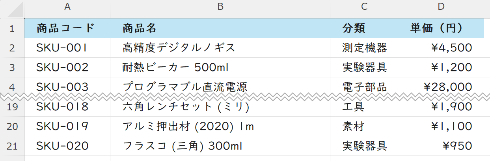
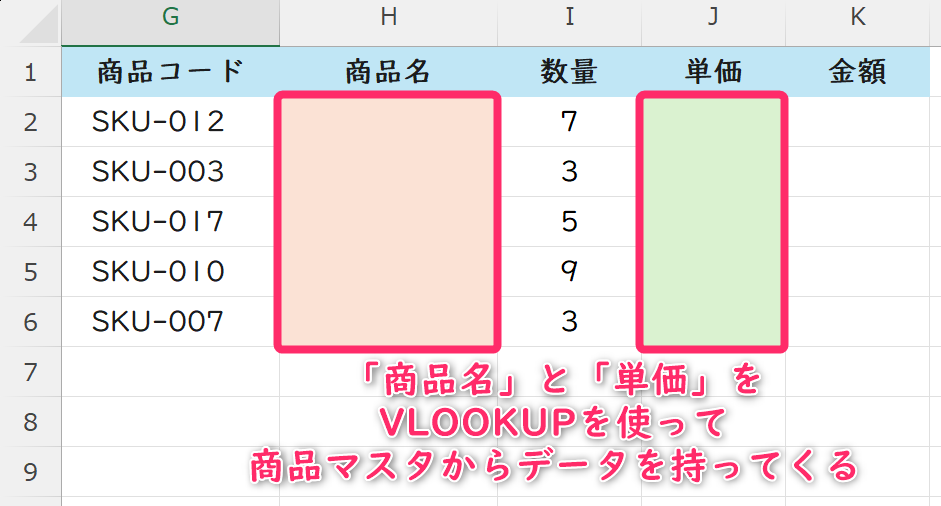
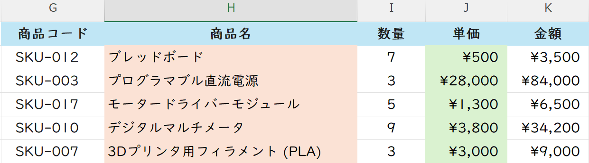
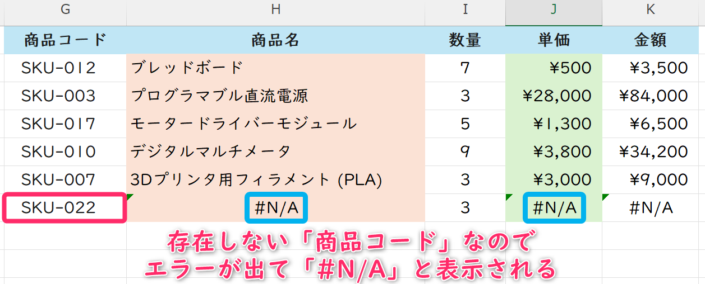
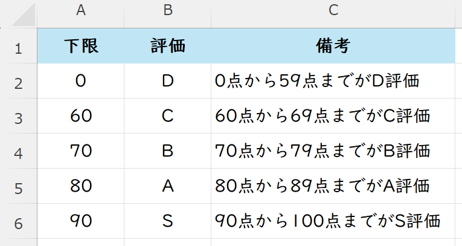
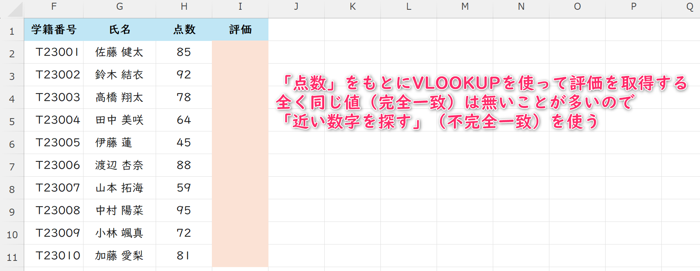
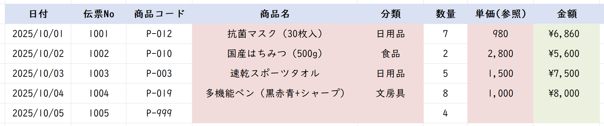
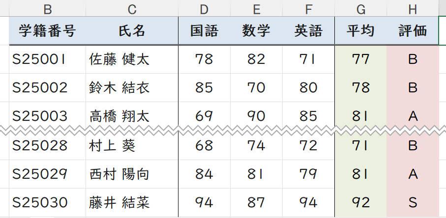

# コンピュータリテラシ応用
# 第7回：Excel いろいろな関数②
### VLOOKUP関数

情報学部 情報学科 情報メディア専攻
清水 哲也 ( shimizu@info.shonan-it.ac.jp )

---

# 今回の目標

- 目標：**VLOOKUPの基本**と**完全一致**，**近似一致**を使い分け、`#N/A`への対処ができる
- 今日やること
  - VLOOKUPの考え方
  - 完全一致
  - 近似一致
  - エラー対処

> Keywords: VLOOKUP, 完全一致, 近似一致, 列番号, IFERROR, 絶対参照

---

# 授業内容

1. **タイピング練習（5分）**
2. 参照の復習（F4で$固定）
3. VLOOKUPの基本
4. 例①：商品コード→商品名，単価（完全一致）
5. 例②：点数→評価（近似一致）
6. エラー対処（IFERROR）と検証


---

# 準備（ファイル）

- Moodleから「07_VLOOKUP_sample.xlsx」をダウンロードする
  

---

# VLOOKUPとは

VLOOKUP ＝ **Vertical Lookup（垂直方向に探す）**

**書式**：`=VLOOKUP(検索値, 範囲, 列番号, [検索方法])`

* **検索値**：探したいキー（例：商品コード）
* **範囲**：**キーが左端列**の表（例：A2:C11）
* **列番号**：範囲の中で何列目を返すか（左から1,2,3…）
* **検索方法**：`FALSE(0)=完全一致` ／ `TRUE(1)=近似一致（範囲一致）`

> 迷ったらまず **FALSE（完全一致）**。表は後で **$A$2:$C$11** のように**絶対参照**へ

---

# 参照の復習（F4で`$`固定）

* 数式中で範囲を選択 → **F4** で `A1` → `$A$1` → `A$1` → `$A1` → `A1` と切替
* ルール：**マスタ表（範囲）は絶対参照**，検索値（入力行）は相対参照

---

# 例題1:商品コード→商品名,単価（完全一致）

シート名：**例題1-商品**

**商品マスタ（A1:D21）**

| 商品コード |         商品名         |   分類   |   単価   |
| ---------- | ---------------------- | -------- | -------- |
| SKU-001    | 高精度デジタルノギス   | 測定機器 | ¥4,500   |
| SKU-002    | 耐熱ビーカー 500ml     | 実験器具 | ¥1,200   |
| SKU-003    | プログラマブル直流電源 | 電子部品 | ¥28,000  |
| $\vdots$   | $\vdots$               | $\vdots$ | $\vdots$ |
| SKU-020    | フラスコ（三角）300ml  | 実験器具 | ¥950     |

---

# 例題1:商品コード→商品名,単価（完全一致）

シート名：**例題1-商品**

**商品マスタ（A1:D21）**



---

# 例題1:商品コード→商品名,単価（完全一致）

シート名：**例題1-商品**

**売上（G1:K6）**

| 商品コード | 商品名 | 数量 | 単価 | 金額 |
| ---------- | ------ | ---- | ---- | ---- |
| SKU-012    |        | 7    |      |      |
| SKU-003    |        | 3    |      |      |
| SKU-017    |        | 5    |      |      |
| SKU-010    |        | 9    |      |      |
| SKU-007    |        | 3    |      |      |

---

<!-- _class: no-footer -->

# 例題1:商品コード→商品名,単価（完全一致）
シート名：**例題1-商品**

**売上（G1:K6）**



---

# 例題1:商品コード→商品名,単価（完全一致）


* **商品名のH2** に：

```
=VLOOKUP(G2,$A$2:$D$21,2,FALSE)
```

このまま，入力して「ブレッドボード」が表示されればOK

* 検索値：**G2**（商品コード）
* 範囲：**A2:D21**（商品マスタ）
* 列番号：**2**（「商品名」は左から2列目）
* 検索方法：**`FALSE(0)=完全一致`**（近い商品コードでは意味がない）


---

# 例題1:商品コード→商品名,単価（完全一致）


* **単価のJ2** は商品コードを元に商品マスタから単価の値を取得したい
* 商品名を関数を参考に単価を取得してみる
* **金額のK2** は「数量」×「単価」の式をいれる
* **単価，金額** は**桁区切り**表示と**通貨(¥)** 表示にする

---

# 例題1:商品コード→商品名,単価（完全一致）

### 結果



---

# 例題1の強化：見つからない時の対応

* 入力ミスや未登録コード → `#N/A` が出る
  


---

# 例題1の強化：見つからない時の対応

* 入力ミスや未登録コード → `#N/A` が出る
* エラーが出たときは◯◯する → `IFERROR(値, エラー時の値)`
* 見た目を整える：

```
=IFERROR(VLOOKUP(G2, $A$2:$D$21, 2, FALSE), "")
```

* 原因調査のコツ：

  * **前後スペース**を削除
  * **全角/半角**の違い
  * **数値と文字列**の不一致（"001" と 1）

---

# 例題2：点数→評価（近似一致）

シート名：**例題2-評価**

**評価表（A1:B6）**(備考は除く)

| 下限点 | 評価  |           備考           |
| :----: | :---: | ------------------------ |
|   0    |   D   | 0点から59点までがD評価   |
|   60   |   C   | 60点から69点までがC評価  |
|   70   |   B   | 70点から79点までがB評価  |
|   80   |   A   | 80点から89点までがA評価  |
|   90   |   S   | 90点から100点までがS評価 |

---

# 例題2：点数→評価（近似一致）

シート名：**例題2-評価**

**評価表（A1:B6）**(備考は除く)



---

# 例題2：点数→評価（近似一致）

シート名：**例題2-評価**

**試験結果（F1:I11）**

| 学籍番号 |   氏名    |   点数   |   評価   |
| -------- | --------- | :------: | -------- |
| T23001   | 佐藤 健太 |    85    |          |
| T23002   | 鈴木 結衣 |    92    |          |
| $\vdots$ | $\vdots$  | $\vdots$ | $\vdots$ |
| T23009   | 小林 颯真 |    72    |          |
| T23010   | 加藤 愛梨 |    81    |          |

---

# 例題2：点数→評価（近似一致）

シート名：**例題2-評価**

**試験結果（F1:I11）**



---

# 例題2：点数→評価（近似一致）

* **I2**（評価）に：

```
=VLOOKUP(H2,$A$2:$B$6,2,TRUE)
```

→ H2の点数に**最も近い下限**の評価を返す

> 近似一致（TRUE）は**左端列が昇順**でないと誤判定する

---

# よくあるつまずき（対処）

* `#N/A`：コード違い／スペース／全半角／文字列と数値の不一致
* `#REF!`：列番号が範囲外（例：列番号=4 なのに範囲が3列）
* ずれる：範囲が相対参照のまま → **$で固定**
* 近似一致が変：**並べ替え忘れ**（左端列が昇順でない）

---

# 課題準備（ファイル）

- MoodleからExcelファイル（`07_VLOOKUP.xlsx`）をダウンロード
- **提出ファイル**：`学籍番号_氏名_07_VLOOKUP.xlsx`
- 保存はこまめに：**Ctrl + S**


---

# 課題1：商品売上

### 使うシート：商品マスタ（参照のみ），売上

* **商品名，分類，単価**は **VLOOKUP（FALSE）** で参照
* 参照範囲は**絶対参照**にすること
* **IFERROR**で未登録時は空欄（`""`）
* 金額は `数量×単価` で計算
* **単価，金額**は，「桁区切り」表示と「通貨記号(¥)」を追加

---

# 課題1：商品売上

結果（備考欄は除く）



---

# 課題2：成績評価

### 使うシート：評価表（参照のみ），評価

* **G列「平均」**
  * 国語，数学，英語の平均点を計算する式を記入
  * 小数点以下の表示をなくし整数表示にする
* **H列「評価」**
  * **平均**をもとにして **VLOOKUP（TRUE）** で評価を取得

---

# 課題2：成績評価

結果



---

## まとめ

* **VLOOKUPの鉄則**：キーは**左端列**、範囲は **$で固定**、迷ったら**FALSE**
* `#N/A`は**IFERROR**で見た目を整え、原因は入力・表の整備で対応
* 近似一致は**並べ替え必須**。安全運用を心がける
