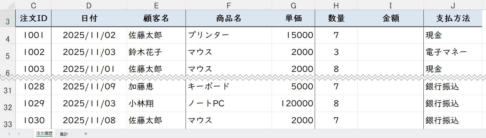
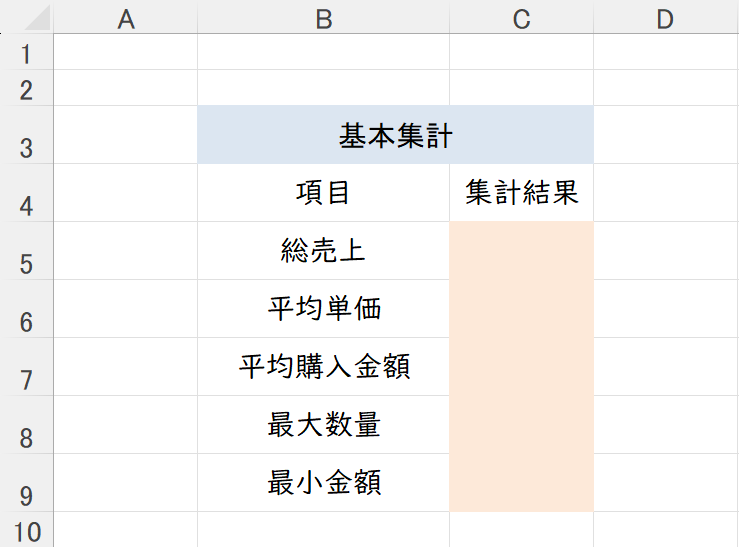
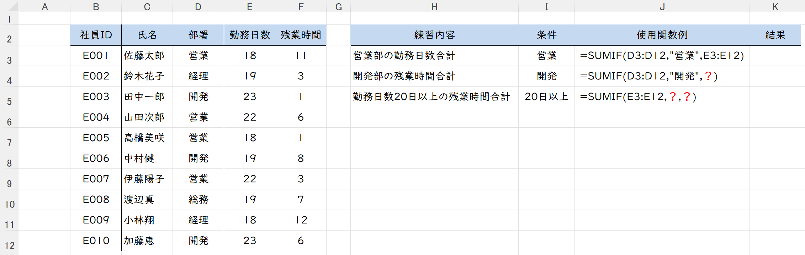
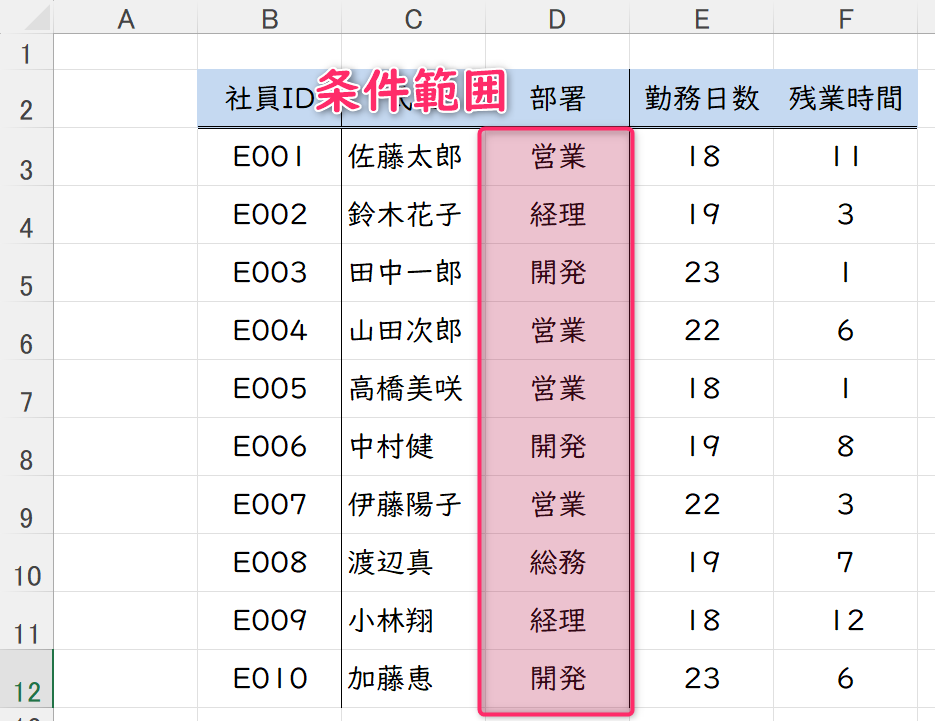
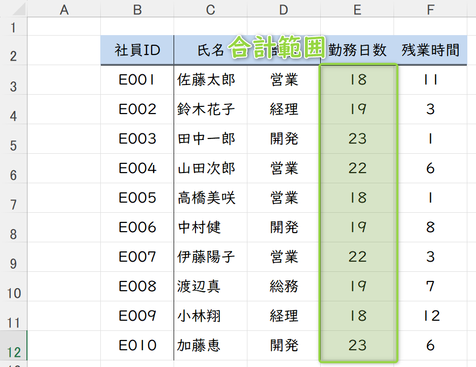
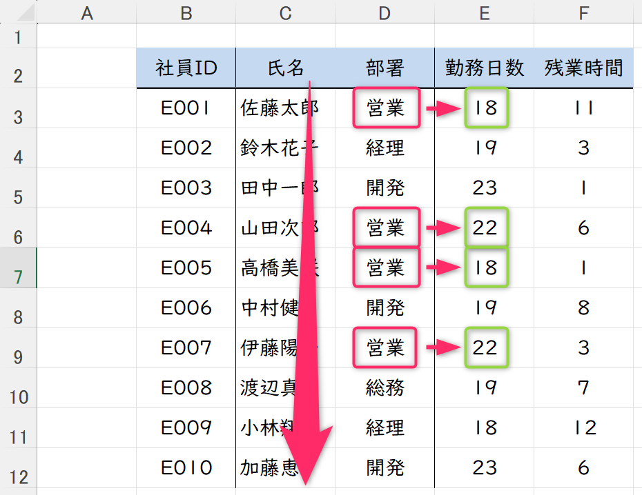
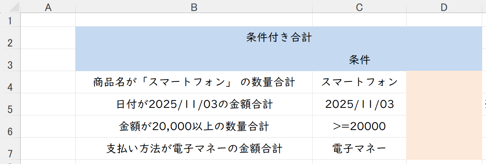
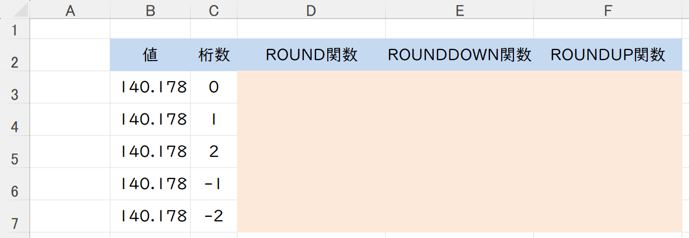
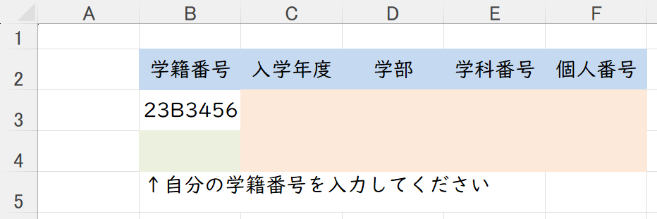
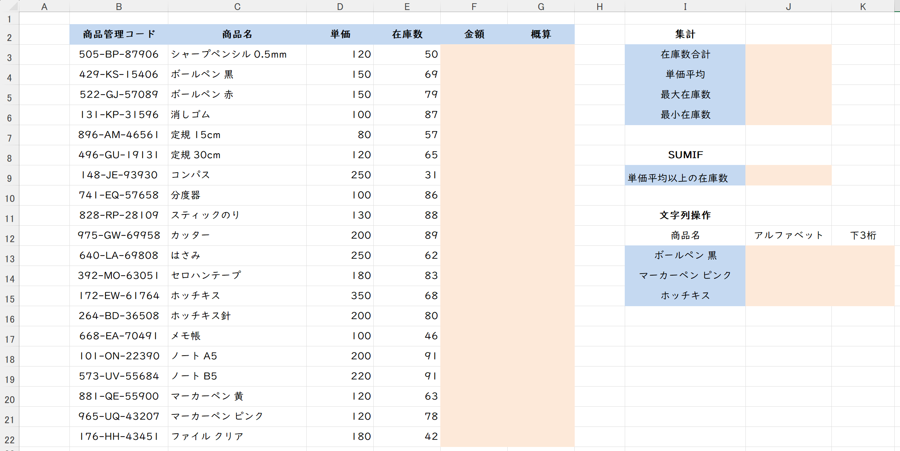

# コンピュータリテラシ応用
# 第8回：Excel いろいろな関数③
### 数式や関数の練習

情報学部 情報学科 情報メディア専攻
清水 哲也 ( shimizu@info.shonan-it.ac.jp )

---

# 今回の目標

- 目標：**合計・集計・丸め・文字抽出**を適切に使い、表を壊さずコピーできる
- 今日やること
  - 基本集計関数`SUM, AVERAGE, MAX, MIN`
  - 条件を付き合計`SUMIF`
  - 丸め関数`ROUND` / `ROUNDDOWN` / `ROUNDUP`
  - 文字関数`LEFT` / `MID` / `RIGHT`

> Keywords: SUM, AVERAGE, MAX, MIN, SUMIF, ROUND, ROUNDUP, ROUNDDOWN, LEFT, MID, RIGHT

---

# 授業内容

1. **タイピング練習（5分）**
2. 基本集計4種の復習
3. **`SUMIF`**（条件付き合計）
4. **丸め関数**：`ROUND` / `ROUNDDOWN` / `ROUNDUP`
5. **文字関数**：`LEFT` / `MID` / `RIGHT`

---

# 準備（ファイル）

- Moodleから「08_Function_sample.xlsx」をダウンロードする

---

# 基本集計4種

- シート：**注文履歴**
- 金額計算：`I列 = G列 × H列`
- G列「単価」，I列「金額」：**桁区切り**，**通貨記号「¥」**

---

# 基本集計4種

* **SUM(範囲)**：合計
* **AVERAGE(範囲)**：平均
* **MAX(範囲)**：最大
* **MIN(範囲)**：最小

---

# 基本集計4種

- シート：**基本集計**

---

# 基本集計4種

- シート：**基本集計**
- **総売上**：「金額」の総額，桁区切り，通貨記号「¥」
- **平均単価**：「単価」の平均，桁区切り，通貨記号「¥」
- **平均購入金額**：「金額」の平均，小数点第2位，桁区切り，通貨記号「¥」
- **最大数量**：「数量」の最大金額
- **最小金額**：「金額」の最少額，桁区切り，通貨記号「¥」

---

# SUMIF（条件付き合計）

**書式**：`=SUMIF(条件範囲, 条件, 合計範囲)`

1. **条件範囲**内で**条件判定**をする
2. 条件に合う行を確認する
3. **合計範囲**内で条件に合う行の値を**合計**する

---

# SUMIF（条件付き合計（例））

- シート：**条件付き合計（例）**
- `sumif`を使って**営業部の勤務日数合計**を求める

---

# SUMIF（条件付き合計（例））

- **条件範囲**：対象が「**営業部**」なのでD列「部署」
- **条件**：対象が「**営業部**」なので「`"営業"`」

---

# SUMIF（条件付き合計（例））

- **合計範囲**：対象が「**勤務日数合計**」なのでE列「勤務日数」

---

# SUMIF（条件付き合計（例））

- `sumif`を使って**営業部の勤務日数合計**を求める
  - 条件範囲：**D列「部署」**
  - 条件：**「営業」**
  - 合計範囲：**E列「勤務日数」**

` =SUMIF(D3:D12,"営業",E3:E12)`

---

# SUMIF（条件付き合計（例））

---

# SUMIF（条件付き合計（例））

- `sumif`を使って**開発部の残業時間合計**を求める
  - 条件範囲：**D列「部署」**
  - 条件：**「開発」**
  - 合計範囲：**F列「残業時間」**
- `sumif`を使って**勤務日数20日以上の残業時間合計**を求める
  - 条件範囲：**E列「勤務日数」**
  - 条件：**「勤務日数が20日以上」** → `">=20"` 
    - ※条件は**文字列**で書く
  - 合計範囲：**F列「残業時間」**

---

# SUMIF（条件付き合計）

**書式**：`=SUMIF(条件範囲, 条件, 合計範囲)`

- シート：**条件付き合計**

---

# SUMIF（条件付き合計）

**書式**：`=SUMIF(条件範囲, 条件, 合計範囲)`

* **商品名が「スマートフォン」** の数量合計
* **日付が2025/10/03**の金額合計
* **金額が20,000以上**の数量合計
* **支払い方法が電子マネー**の金額合計

---

# 丸め：ROUND / ROUNDDOWN / ROUNDUP

**書式**：`=ROUND(数値, 桁数)`
- 一般的な「四捨五入」（ `4`以下は切り捨て，`5`以上は切り上げ）
- 例：`123.4` → `123`, `123.5` → `124`

**書式**：`=ROUNDDOWN(数値, 桁数)`
- すべて切り捨て
- 例：`123.4` → `123`, `123.5` → `123`

**書式**：`=ROUNDUP(数値, 桁数)`
- すべて切り上げ
- 例：`123.4` → `124`, `123.5` → `124`

---

<!-- _class: no-footer -->

# 丸め：ROUND / ROUNDDOWN / ROUNDUP

**共通書式**：`=関数(数値, 桁数)`
* **桁数**の意味：
  * `2` → 小数点**第2位まで**
  * `0` → **整数**に丸め
  * `-1` → **10の位**、`-2` → **100の位**

| 元の値 | 桁数 | ROUND |     ROUNDDOWN      |         ROUNDUP          |
| -----: | ---: | ----: | -----------------: | -----------------------: |
| 12.345 |    2 | 12.35 |              12.34 |                    12.35 |
| 12.345 |    0 |    12 |                 12 |                       13 |
|    155 |   -1 |   160 |                150 |                      160 |
| -12.34 |    1 | -12.3 | -12.3（**0方向**） | -12.4（**0から離れる**） |

---

# 丸め：ROUND / ROUNDDOWN / ROUNDUP

**共通書式**：`=関数(数値, 桁数)`

- シート：**丸め**

---

# 文字関数：LEFT / MID / RIGHT

* **LEFT(文字列, 文字数)**：左から取り出す
* **MID(文字列, 開始位置, 文字数)**：途中から取り出す
* **RIGHT(文字列, 文字数)**：右から取り出す

**例：コード `P-2025-00123` から抽出**

* 種別：`=LEFT(A2,1)` → `P`
* 年：`=MID(A2,3,4)` → `2025`
* 連番：`=RIGHT(A2,5)` → `00123`

> 注意：**全角/半角**も1文字として数える。桁が可変なら `FIND/SEARCH` で位置を探す（今回は紹介のみ）。

---

# 文字関数：LEFT / MID / RIGHT

- シート：**文字列操作**

---

# 課題準備（ファイル）

- MoodleからExcelファイル（`08_Function.xlsx`）をダウンロード
- ファイル名変更：`学籍番号_氏名_08_Function.xlsx`
- 保存はこまめに：**Ctrl + S**

---

# 課題ファイルの確認

---

# 課題1

- **F列「金額」**
  - 「単価」×「在庫数」
  - 桁区切り，通貨記号「¥」設定
- **集計** 
  - **J3セル**：在庫数合計
  - **J4セル**：単価平均
  - **J3セル**：最大在庫数
  - **J3セル**：最小在庫数

---

# 課題2 SUMIF

- 単価平均以上の在庫数合計を求める
- 課題1で求めた「**単価平均**」を参照する
- `SUMIF(条件範囲, 条件, 合計範囲)`
  - 条件範囲は？
  - 条件は？（必ず，単価平均結果を参照すること）
  - 合計範囲は？

---

# 課題3 ROUND / ROUNDDOWN /ROUNDUP

- **G列「概算」**
  - F列「金額」を1000円未満で切り上げ
  - 桁区切り設定
  - 関数は？ROUND？ROUNDDOWN？ROUNDUP？
  - 桁数は？

---

# 課題4 文字列操作

- 該当商品名の「**商品管理コード**」を利用
- アルファベット2桁の抽出
- 下3桁の抽出
- 例：123-AB-45678
  - アルファベット2桁：「AB」
  - 下3桁：「678」
- 関数は？LEFT？MID？RIGHT？

---

# よくあるつまずき（対処）

* **SUMIFが0**：条件が文字列でない／全半角違い → `"文具"`、`TRIM`で空白削除
* **丸め桁の勘違い**：`-1`は10の位、`-2`は100の位
* **ROUNDUP/DOWNの向き**：`UP=0から離れる / DOWN=0に近づく`
* **文字抽出の位置**：`MID(開始位置は1始まり)`、桁ミスに注意

---

# 参考ショートカット

* **F2**：セルの式を確認
* **F4**：`$` 切替（参照固定）
* **Ctrl+`**：式の表示切替
* **Ctrl+1**：書式設定

---

## まとめ

* 基本集計は**復習**、本日の柱は **SUMIF / 丸め / 文字抽出**
* 条件は**文字列**、丸めは**桁数の解釈**、文字は**桁の数え方**に注意
* **1つ作って下へコピー → 壊れないか確認**が基本動作
