# コンピュータリテラシ応用
# 第10回：データベースの利用
### 並べ替えとオートフィルター

情報学部 情報学科 情報メディア専攻
清水 哲也 ( shimizu@info.shonan-it.ac.jp )

---

# 今回の目標

- 目標：**安全に並べ替え**し、**条件で絞り込み**ができるようになる（AND/OR・Top10・期間）
* 今日やること：並べ替え（昇順/降順/複数キー）→オートフィルター（文字/数値/日付/色）→よくある事故対策→演習・提出

> keyword : Header, Table (Ctrl+T), Multi-key Sort, Filters (Text/Number/Date), Clear Filter

---

# 授業内容

1. **タイピング練習**
2. データ準備とルール
3. 並べ替え：基本→複数キー→ユーザー設定リスト
4. オートフィルター：基本→条件（文字/数値/日付）→色/上位
5. 安全運用とトラブル対処

---

# 準備（ファイル） **※後で修正**

- Moodleから「09_Charts.xlsx」をダウンロードする
- ファイル名変更：`学籍番号_氏名_09_Charts.xlsx`
- 保存はこまめに：**Ctrl + S**

---

---

# データ準備：表の約束

* データの1行目は**見出し（ヘッダー）**、空白行は入れない
* レコード：1レコード=1行（結合セルは**禁止**）
* フィールド：列単位のデータ
* 列は**型をそろえる**（数値・日付・文字）
* 範囲をすばやく扱うなら **テーブル化（Ctrl+T）** が便利（見出し固定・フィルター自動）

---

<!-- _class: no-footer -->

# データ準備：表の約束

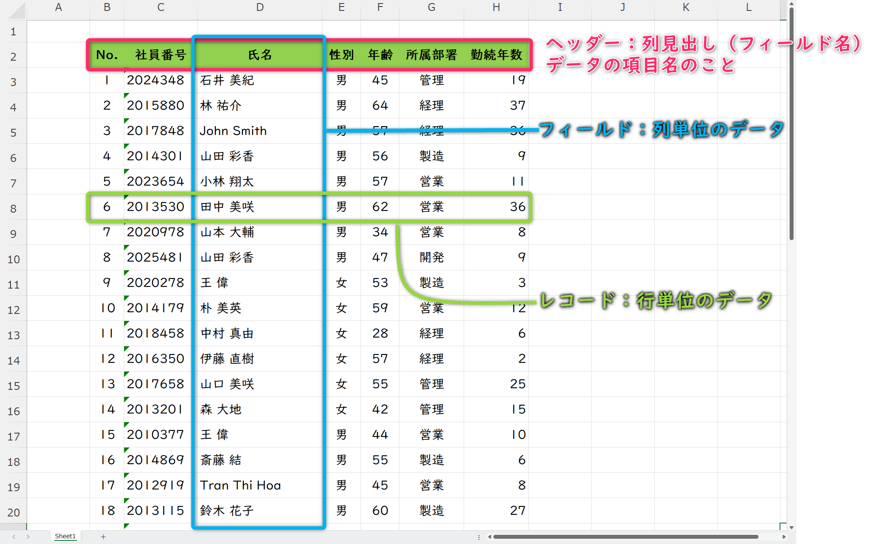

---

# 並べ替え（基本）

* データ内（表内）の任意セルを選ぶ → **ホーム＞並べ替えとフィルター** → 「昇順/降順」
* 並べ替えはレコード毎並べ替える
* 選んだセルのフィールド（項目）を基準に並べ替えが行われる
* 例：F12セル（項目：年齢） → 年齢順に並べ替え

---

# 並べ替え（基本）

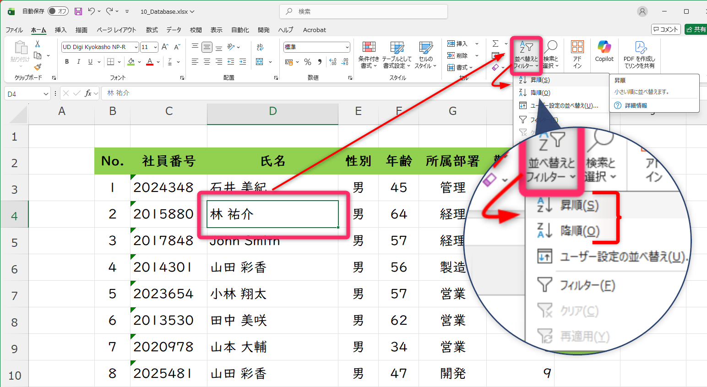

---

# 並べ替え（基本）

- データの種類によって並べられる順序がある

| データの種類 | 昇順の順序 | 降順の順序 |
| :----------: | :--------: | :--------: |
|     数値     |   0 → 9    |   9 → 0    |
|     日付     |  古 → 新   |  新 → 古   |
|     英字     |   A → Z    |   Z → A    |
|     かな     |  あ → ん   |  ん → あ   |
|  JISコード   |  小 → 大   |  大 → 小   |

※ [JISコード](https://www.asahi-net.or.jp/~ax2s-kmtn/ref/jisx0213/index.html)は漢字や記号などを管理してる番号なんで，漢字の読み，意味に関係なくその番号でならべられます

---

# 複数キーの並べ替え

**例：所属部署→年齢（昇順）→勤続年数（降順）**

1. **データ＞並べ替え**
2. **レベルの追加**でキーを3つ：

   * 所属部署（値／昇順）
   * 年齢（値／昇順（小さい順））
   * 勤続年数（値／**降順**（大きい順）＿）
3. OK → 期待通りに並ぶか確認

---

# 複数キーの並べ替え

**例：所属部署→年齢（昇順）→勤続年数（降順）**

1. **データ＞並べ替え**

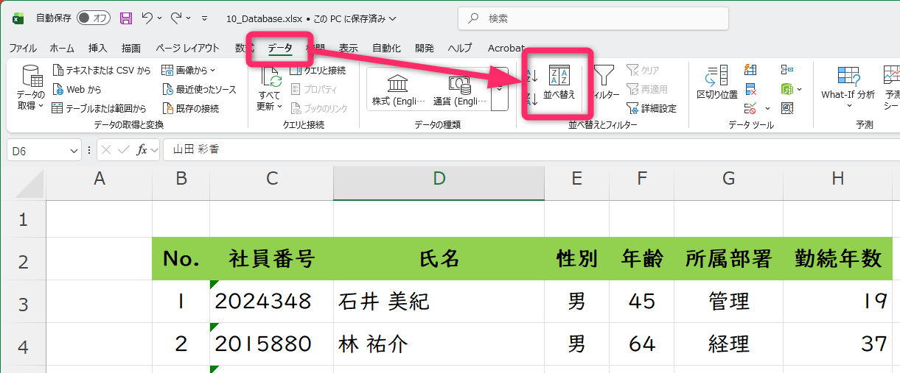

---

# 複数キーの並べ替え

**例：所属部署→年齢（昇順）→勤続年数（降順）**

1. **レベルの追加**でキーを3つ：

   * 所属部署（値／昇順）

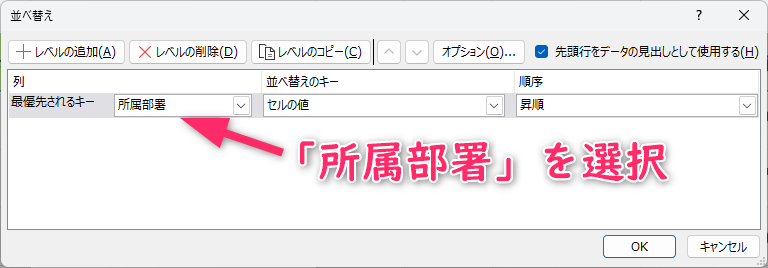

---

<!-- _class: no-footer -->

# 複数キーの並べ替え

**例：所属部署→年齢（昇順）→勤続年数（降順）**

1. **レベルの追加**でキーを3つ：

   * 所属部署（値／昇順）
   * 年齢（値／昇順（小さい順））
   * 勤続年数（値／**降順**（大きい順））

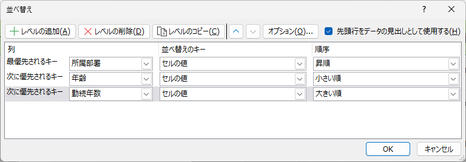

---

# ユーザー設定リストで並べ替え

数値/五十音ではない順序で並べたいとき：
例：所属部署で昇順に並べ替えすると
- 営業 → 開発 → 管理 → 経理 → 製造（JISコード順）
これを
- 経理 → 管理 → 営業 → 開発 → 製造
にする

1. **データ＞並べ替え** → キー：所属部署 → **順序：ユーザー設定リスト**
2. **新しいリスト**を選択
3. リストの項目：「経理, 管理, 営業, 開発, 製造」を入力
4. OK

---

# ユーザー設定リストで並べ替え

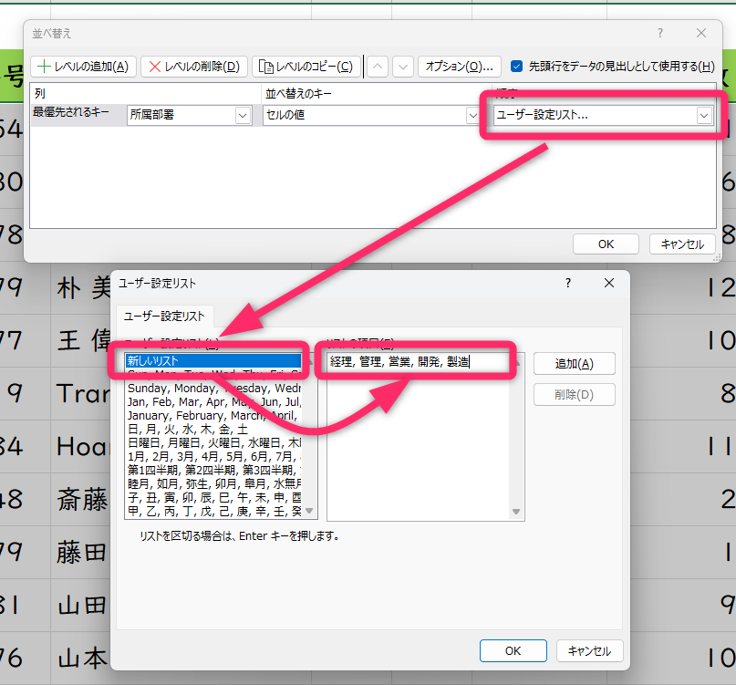

---

# オートフィルター（基本）

* オートフィルターを表示する方法
  * テーブル化（**`Ctrl+T`**）で自動ON
  *  **`Ctrl+Shift+L`** で切替
  *  **ホーム＞並べ替えとフィルター＞フィルター**で切替

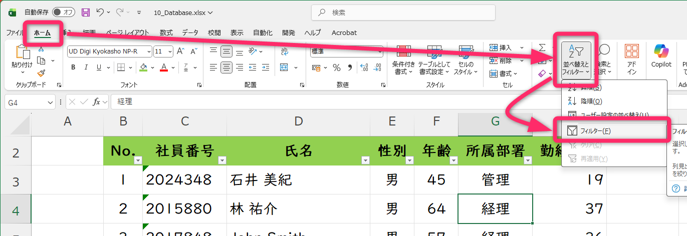

---

# オートフィルター（基本）

* 列見出しの▼から**チェックボックス**で絞り込み
* **フィルタークリア**：列の▼→**フィルターのクリア**

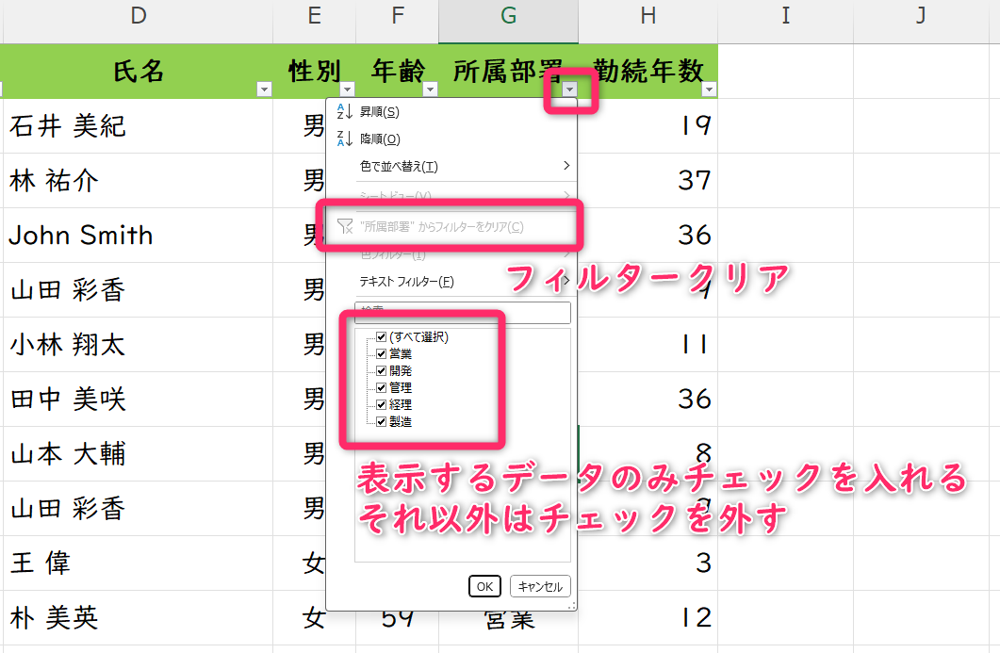

---

# テキスト・数値・日付フィルター

テキストフィルター
- 指定の値に等しい
- 指定の値に等しくない
- 指定の値で始まる
- 指定の値で終わる
- 指定の値を含む
- 指定の値を含まない
- ユーザ設定フィルター

---

# テキスト・数値・日付フィルター

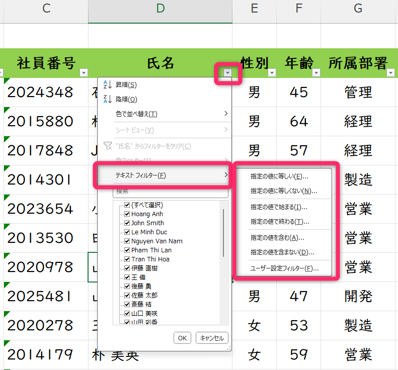

---

# テキスト・数値・日付フィルター

### 文字（テキストフィルター）

* **次の値を含む**（例：`山`）

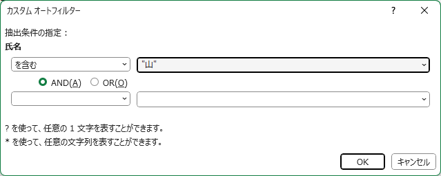

---

# テキスト・数値・日付フィルター

### 数値（数値フィルター）

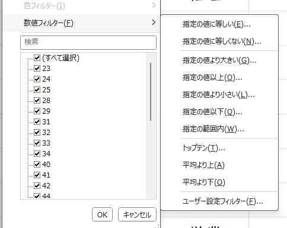

---

# テキスト・数値・日付フィルター

### 日付（日付フィルター）

* **今年/先月/来月** などのクイック選択
* **期間指定**（**指定の範囲**：開始日〜終了日）

---

# 色でのフィルター/並べ替え

* 条件付き書式や手作業で付けた**セルの色／フォントの色**で並べ替え・フィルター可能
* 例：勤続年数で色分け＞色でのフィルター
   1. 勤続年数（`H3`から`H42`）を選択
   2. **条件付き書式＞カラースケール**から**青，白，赤のカラースケール**
   3. **▼＞色フィルター**から適当な色選択

---

# よくある事故と回避

* **列だけ**を選んで並べ替え → 行が崩壊 → *拡張して選択*
* 見出し行が**空欄**だと、データとして扱われてソートに混ざる → 見出しを必ず入れる
* **結合セル**があるとソート不可 → 解除してから実行
* 数値が**文字列**扱い（左寄せ/三角警告） → `データ＞区切り位置＞完了` で数値に直す

---

# 小ワザ（ショートカット）

* **Ctrl+T**：テーブル化（解除は 右クリック＞テーブル＞範囲に変換）
* **Ctrl+Shift+L**：フィルターON/OFF
* **Alt+↓**：フィルターの▼を開く（Win）
* **Ctrl+G → 特殊**：空白セルへ一気に移動→入力/削除

---

# 課題

**提出ファイル**：`学籍番号_氏名_10_SortFilter.xlsx`

### 演習A：並べ替え（30点）

* 学科→氏名（昇順）→点数（降順）の**複数キー**
* 別シートで**曜日順（ユーザー設定リスト）**の並べ替え

### 演習B：フィルター（40点）

* テキスト：`「学」` を含むレコードのみ
* 数値：`点数 >= 70` かつ `欠席 <= 3`
* 日付：`2025/10/01〜2025/10/31` の範囲
* Top10：売上の**上位5件**

---

## まとめ

* **並べ替え＝見せる順番**、**フィルター＝見せる範囲**
* Ctrl+Tで**壊れにくい表**→複数キー/条件で素早く分析
* 次回：**ピボットテーブル入門**（予定）
