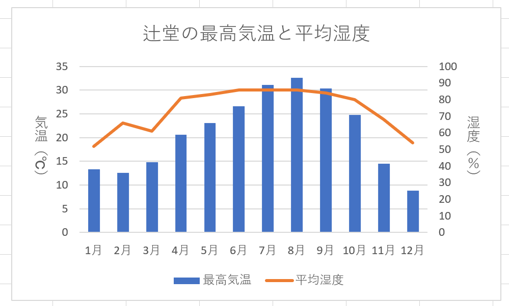
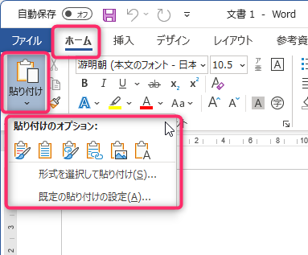

# コンピュータリテラシ応用
# 第11回：表やグラフの貼り付け

情報学部 情報学科 情報メディア専攻
清水 哲也 ( shimizu@info.shonan-it.ac.jp )

---

# 今回の目標

- 目標：**崩れない表**と**読みやすい図**を、レポート／発表資料に**正しく挿入**できる

> keyword : Paste Options, Paste Special, Embed vs Link, Table Formatting, Chart Picture (EMF/PNG), Captions & Cross-references

---

# 授業内容

1. **タイピング練習**
2. データ整形（Excel側の下準備）
3. 表の貼り付け（Word）
4. グラフの貼り付け：Embed / Link / Picture
5. 仕上げ：キャプション・参照・整列

---

# 準備（ファイル）

- Moodleから「11_Data.xlsx」をダウンロードする
- ファイル名変更：`学籍番号_氏名_11_Data.xlsx`
- 保存はこまめに：**Ctrl + S**

---

<!-- _class: no-footer -->

# Excel側の下準備

* テーブル化（`Ctrl` + `T`）する
* グラフは**複合グラフ（集合縦棒 - 折れ線）**

---

# 表の貼り付け（Word）

**基本操作**

* Excelで範囲選択 → **Ctrl+C**
* Wordで **ホーム＞貼り付け（▼）＞貼り付けのオプション**

**主な選択肢**

* **元の書式を保持**（表デザインをExcelのまま）
* **貼り付け先のスタイルを適用**（Wordの書式に合わせる）
* **テキストのみ保持**（貼り付け後にWordで表にする）

---

# 表の貼り付け（Word）

---

# 表の貼り付け（Word）

**貼り付け以外の選択肢**

ただ形式を選択して貼り付ける以外に「**リンク貼り付け**」がある
元ファイル（今回は11_Data.xlsx）へのリンク追加した貼り付け方法である
これは，表をクリックする元ファイルへ移動する

**注意**：リンク貼り付けはある意味便利だが，ファイルの移動などをするとリンク切れになる

---

# 表の貼り付け（PowerPoint）

* PowerPointでも**貼り付けオプション**は同様
* スライド幅に合わせて**固定列幅**に整える
* **配置＞左右中央/上下中央/整列/等間隔**で見栄えを整える
* 文字サイズは**本文相当（24pt前後）**を目安

---

# グラフの貼り付け：3つの方式

| 方式               | 手順                                | 長所                    | 注意                       |
| ---------------- | --------------------------------- | --------------------- | ------------------------ |
| **埋め込み**  | 通常貼り付け／貼り付けのオプションで**グラフ（オブジェクト）** | Word/PPT内でグラフ編集可      | ファイルが重い、無断変更の恐れ          |
| **リンク貼付**  | **貼り付けの形式＞リンク貼り付け**→Excel Chart   | 元ブック更新で**自動反映**       | パスが変わると切れる、配布時に元ファイル同梱必須 |
| **画像化** | **コピー＞貼り付けの形式：Picture（EMF/PNG）**  | 軽量、形が崩れない、**EMFはベクタ** | 画像としてしか編集できない（数値再計算不可）   |

---

# Pictureの選び方（画質と再現性）

* **EMF（推奨）**：ベクタ。拡大しても劣化しにくい（Windows）
* **PNG**：ラスター。透明背景可。**300dpi**程度を目安
* サイズは**角のハンドルのみ**で変更（縦横比を保持）。**図の書式設定＞サイズ＞縦横比を固定**

---

# Link（リンク貼付）の実務

* Word：**ファイル＞情報＞ファイルへのリンクの編集**で更新/切断
* フォルダー構成は**相対パス**を保つ（WordとExcelを同一フォルダーに）
* 共有時は**両方まとめてZip**に

---

# 図の仕上げ（論文向け）

* **軸ラベル＋単位**、0起点（棒）、小数桁・桁区切り
* 色は**白/灰＋強調1色**、凡例は重ならない位置
* **キャプション**：**挿入＞キャプション**（*図1 学科別レポート提出数*）
* **本文から参照**：**挿入＞相互参照**（図番号）
* **Alt Text**（代替テキスト）で内容の要約
* 最後に **Ctrl+A → F9** でフィールド更新（図番号・参照）

---

# 表の仕上げ（論文向け）

* **表1 〜** のキャプション（表は**上**、図は**下**が通例）
* **桁揃え**（右/中央/小数点揃え）、**見出し行の繰り返し**
* 罫線は**最小限**、数値は**小数/桁区切り**を統一
* 必要なら**注**を表の直下に（例：*注）n=120, 平均±SD*）

---

# Word / PowerPoint 小ワザ

* **重なりの解消**：選択ウィンドウ（ホーム＞選択＞選択ウィンドウ）
* **整列**：図形を複数選択→配置→**整列/均等割り付け**
* **画像圧縮の無効化**：ファイル＞オプション＞詳細設定＞**イメージのサイズと画質**
* **グリッド/ガイド**：表示＞**ガイド/グリッドにスナップ**

---

#　課題

**課題1：表貼付の比較（Word）**

* 同一範囲を ①元の書式保持 ②貼り付け先のスタイル ③テキストのみ→表 で3通り作成。
* 列幅の自動調整→固定列幅、見出し行の繰り返し、行の分割を許可しないを確認。
* *メモ欄*：最も論文に向く方法と理由を1行で。

---

#　課題

**課題2：グラフ貼付の比較（Word）**

* 同一グラフを ①Embed ②Link（相対パス）③Picture（EMF）で貼付。
* Linkは元ブックを上書き→**更新**動作を確認。Pictureは比率固定。
* 各図に **Alt Text** と **図番号＋キャプション** を付ける。

---

#　課題

**課題3：整列と体裁（PowerPoint）**

* ガイド/スナップを使い、図表とテキストを **整列/均等割付**。

---

#　課題の提出物

- Excel：学籍番号_氏名_11_Data.xlsx
- Word：学籍番号_氏名.docx
- PowerPoint：学籍番号_氏名.pptx

---

## 14) まとめ

* 用途で**Embed/Link/Picture**を使い分ける
* 最終版は**画質（EMF）**と**参照（キャプション）**で論文品質へ
* 表は崩さず、図は読みやすく——それだけで仕上がりが一段上がります
